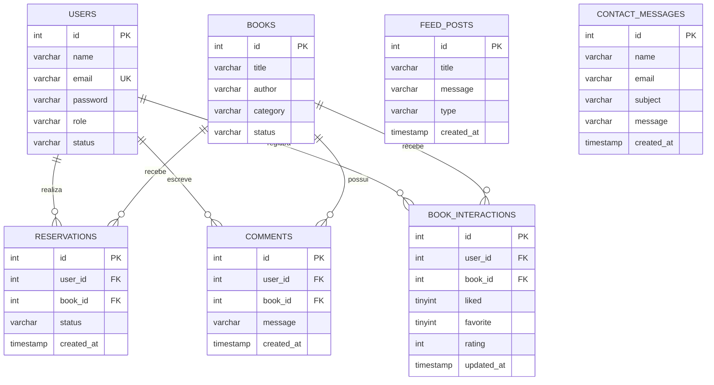
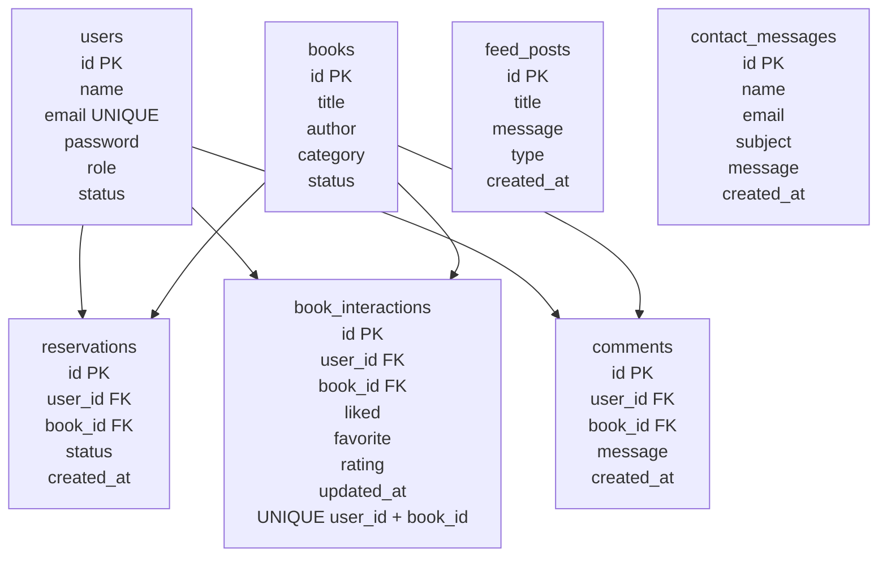
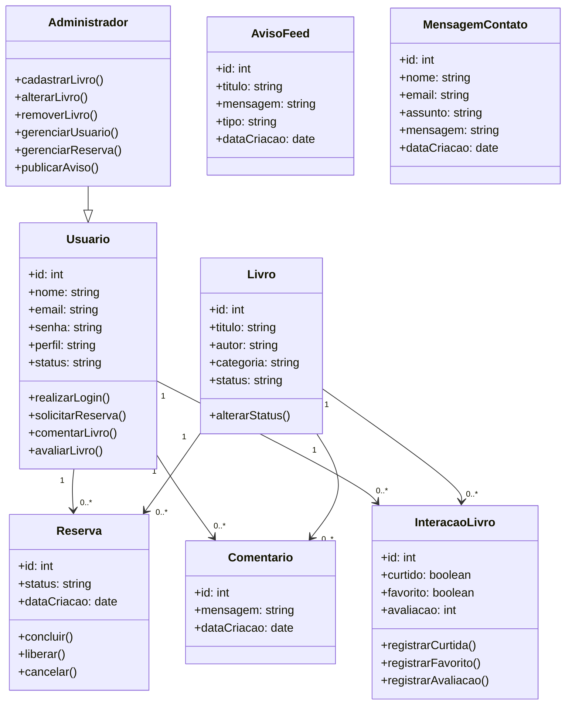
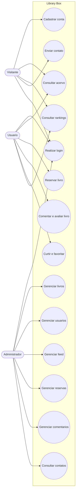
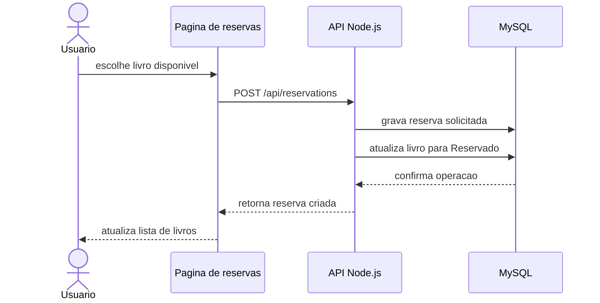
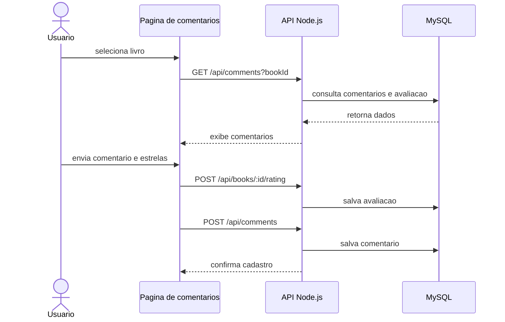
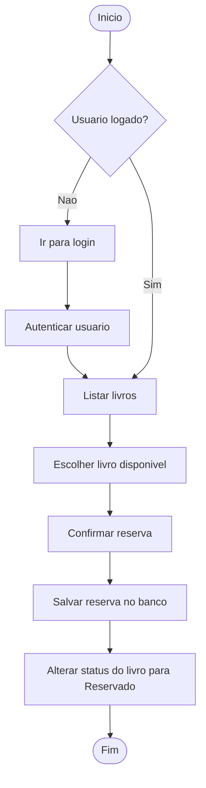
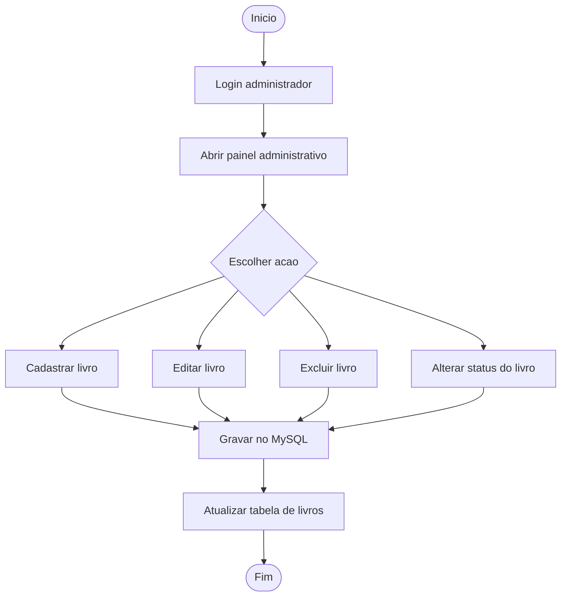

# Diagramas atualizados - Library Box

## Modelo Entidade-Relacionamento

## Modelo Logico do Banco

## Diagrama de Classes

## Diagrama de Caso de Uso Geral

## Diagrama de Sequencia - Reserva de Livro

## Diagrama de Sequencia - Comentario e Avaliacao

## Diagrama de Atividades - Fluxo de Reserva

## Diagrama de Atividades - Administracao do Acervo

